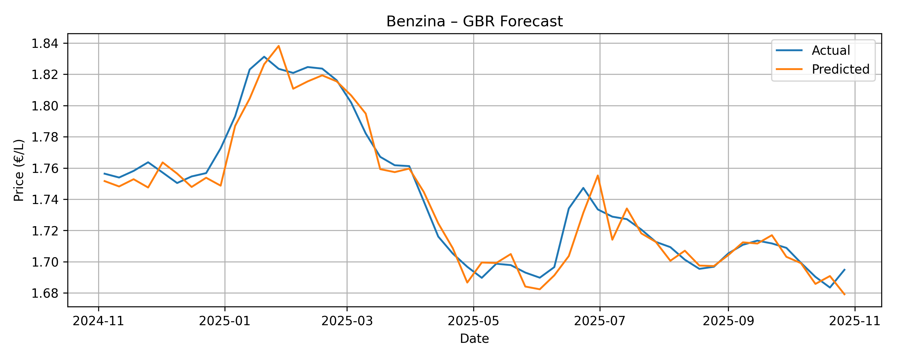
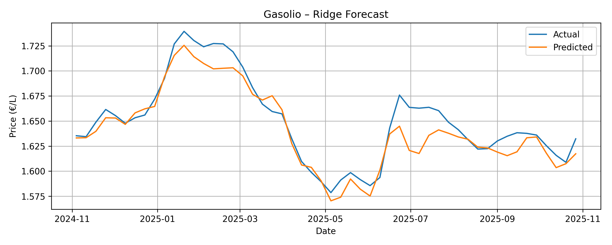

# Fuel Price Forecasting Project

This repository contains a complete workflow for building a machine learning system to forecast weekly fuel prices in Italy, specifically **Benzina** and **Gasolio**. The workflow includes data cleaning, feature engineering, model training, evaluation, and a prediction pipeline.

The project is intentionally structured in separate, incremental notebooks to help beginners understand each step clearly.

---

## 1. Project Structure

```
project_root/
│
├── data/
│   ├── raw/                # Original CSV files (fuel, Brent, USD/EUR)
│   ├── processed/          # Cleaned and engineered datasets
│   └── processed/features_dataset_v2.csv
│
│
├── notebooks/
│   ├── 01_exploration.ipynb
│   ├── 02_cleaning.ipynb
│   ├── 03_processing.ipynb
│   ├── 04_feature_engineering.ipynb
│   ├── 05_training_v1.ipynb
│   ├── 06_training_v2.ipynb
│
├── requirements.txt
└── README.md
```

---

## 2. Problem Description

The goal of this project is to predict **next week's** fuel prices in Italy. The prediction is based on:

* past fuel prices (lags and rolling averages)
* past Brent oil prices (in EUR)
* USD/EUR exchange rate
* derived features (percentage changes, seasonality)
* calendar information

This is a **time-series regression problem**.

---

## 3. Data Sources

The project uses three weekly datasets:

### 3.1 Fuel Prices (Italy)

* Contains weekly Benzina and Gasolio prices.
* Dates are on **Mondays**.

### 3.2 Brent Oil Futures

* Quoted in USD.
* Converted into EUR using the exchange rate.
* Dates are originally on **Sundays**, shifted to Monday for alignment.

### 3.3 USD/EUR Exchange Rate

* Used to convert Brent USD → Brent EUR.

---

## 4. Notebooks Overview

Each notebook performs one clear task.

### **01_data_exploration_and_cleaning.ipynb**

Basic checks of the raw datasets:

* structure
* missing values
* columns
* date ranges

Cleans each dataset:

* converts dates
* standardizes number formats
* removes unused columns
* ensures correct dtypes
* saves `fuel_clean.csv`, `brent_clean.csv`, `usd_eur_clean.csv`

### **02_data_processig.ipynb**

Creates a **weekly aligned merged dataset**:

* shifts Brent and FX dates to Monday
* converts Brent USD → Brent EUR
* merges with fuel dataset
* saves `weekly_dataset.csv`

### **03_naive_model.ipynb**

Creates a **naive model** and a **seasonal naive model** to get a baseline forecasting.

### **04_feature_engineering.ipynb**

Creates model-ready features:

* lags (1–4 weeks)
* rolling averages
* percent changes
* spreads
* seasonal features (month, sine/cosine)
* saves `features_dataset_v2.csv`

### **05_training_v1.ipynb**

Baseline modeling:

* naïve model
* seasonal naïve model
* Ridge and Gradient Boosting (initial version)

### **06_training_v2.ipynb**

Improved feature set and modeling:

* enriched features
* updated Ridge / GBR models

---

## 5. Results

### Final models:

* **Benzina:** Gradient Boosting Regressor
* **Gasolio:** Ridge Regression

These were chosen because:

* they consistently outperformed naïve baselines
* they behaved well with limited weekly data
* they generalized reliably without overfitting

### Model Performance

| Model | Benzina MAE | Gasolio MAE |
|-------|-------------|-------------|
| Naïve | 0.0111 | 0.0113 |
| Final Model | 0.0076 | 0.0108 |




### Conclusions

- The final models outperform the naïve baseline on the last 52 unseen weeks:
  - **Benzina:** MAE improved from **0.0111 → 0.0076** (≈ **31%** error reduction)
  - **Gasolio:** MAE improved from **0.0113 → 0.0108** (≈ **4%** error reduction)
- Improvements are larger for Benzina, while Gasolio is harder to beat because its week-to-week changes are smaller and more stable.
- The evaluation uses a time-based split (last 52 weeks) to avoid leakage and reflect a real forecasting scenario.

### Limitations & Next Steps

- The model does not explicitly include tax changes or policy shocks, which can cause sudden jumps.
- Possible improvements: add external drivers (inflation, taxes), perform walk-forward cross-validation, and build an automated weekly forecasting script.
---

---

## 6. Installation

Create a virtual environment (recommended):

```
python -m venv .venv
source .venv/bin/activate
```

Install requirements:

```
pip install -r requirements.txt
```

---

## 7. Requirements

A `requirements.txt` file is provided and includes:

```
pandas
numpy
scikit-learn
matplotlib
```

(See `requirements.txt` in the repository.)

---

## 8. Future Work

Planned improvements:

* advanced feature engineering 
* hyperparameter tuning for deeper optimization
* multi-step forecasting (2+ weeks ahead)
* automated weekly data ingestion
* Streamlit dashboard for visualization
* Docker packaging
